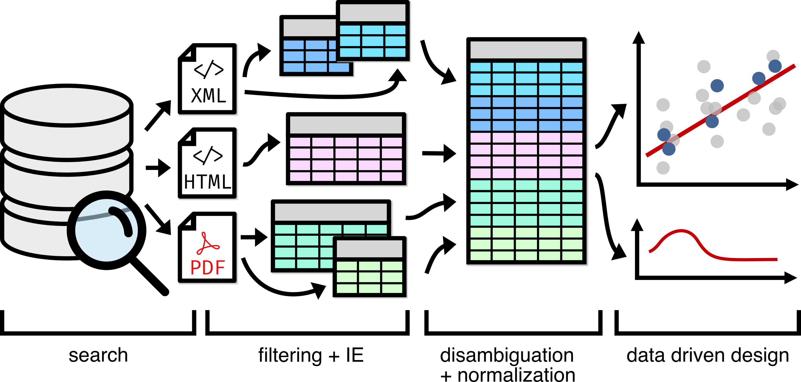

# Data Driven Design as an Ecologically Valid Challenge Task for Document Understanding

This repo contains the code and metadata for the paper "Data Driven Design as an Ecologically Valid Challenge Task for Document
Understanding". 



---

## Environment Setup

Install the dependencies for the repo as follows:

```bash
pip install -r requirements.txt
```

## Metadata and Dataset Reconstruction

Because this dataset consists of non-open access academic papers, we are limited to providing the
metadata for this dataset, i.e. the DOIs of the papers, and publishing our further annotated 
versions of the zeolite data originally published in Jensen et. al. (2019) and the aluminum data 
from Pfeiffer et. al. (2020). Our re-annotated versions of this data can be found in the respective
folders in the `data/` directory. 

We additionally provide our EDA notebooks in this repository, as `eda_zeolite.ipynb` 
and `eda_aluminum.ipynb`, respectively.

To reconstruct the sections of the dataset that are available from publisher TDM APIs, we provide 
the `construct_dataset.py` script. This script pulls papers in publisher provided format from the 
APIs of three publishers: Elsevier, Wiley, and Springer, assuming that the user is licensed 
appropriately. To use this script, you must first get API keys for Elsevier 
[here](https://dev.elsevier.com/) and Wiley 
[here](https://onlinelibrary.wiley.com/library-info/resources/text-and-datamining). 
The user must then specify these API keys, along with a mailto address for the 
[polite](https://github.com/CrossRef/rest-api-doc#good-manners--more-reliable-service) usage
tier of the Crossref API for Springer papers, in `secrets.json`:

```json
{
    "ELSEVIER_API_KEY": "...",
    "WILEY_API_KEY": "...",
    "SPRINGER_MAILTO": "..."
}
```

Once the secrets file has been set up appropriately, you can run the construct dataset script:

```bash
python construct_dataset.py --dataset=<zeolite|aluminum> --from_scratch=<False|True>
```

This script will download XML from Elsevier, PDFs from Wiley, and both PDF and an HTML/XML 
representation from Springer, and place them in `xml` and `pdf` directories within the data 
directory for each dataset. The `from_scratch` parameter determines whether the script will fetch
publisher metadata afresh (not recommended) or use the version already provided in 
`data/<dataset>/publisher_metadata.csv`. It will not replace files that have already been downloaded.
Every file is stored in the format `<doi>.<extension>` where the DOI has had filesystem noncompliant 
characters, e.g. "/" replaced with underscores.

For models that do not accept PDFs, and require images of individual pages instead, we provide the 
`generate_page_images.py` script, which will segment PDFs into pages and write PNGs of those pages
to individual files, in the format `<doi>_<page_number>.<extension>`. 

## Running Baselines

TBD. 

We provide our baseline predictions in the `predictions/` folder. 

## Evaluation

Once predictions have been generated, run the evaluation script with the following command:

```bash
python evaluate_and_report.py --dataset=<zeolite|aluminum> --modality=<pdf|xml> --predictions_path=...  
```

This will evaluate the provided predictions against ground truth, and generate a json report with 
both final results and per-location results in a file with the same filename as the predictions, in
the same directory. This script expects a predictions file in CSV format with a "doi" column, and
additional columns corresponding to the columns to predict in the dataset. 

## Baseline Results

## Regenerating figures from the paper. 

Baseline figures TBD. 

To regenerate the location visualization (figure 2 in the paper), run the cells in the
`location_visualization.ipynb` notebook.